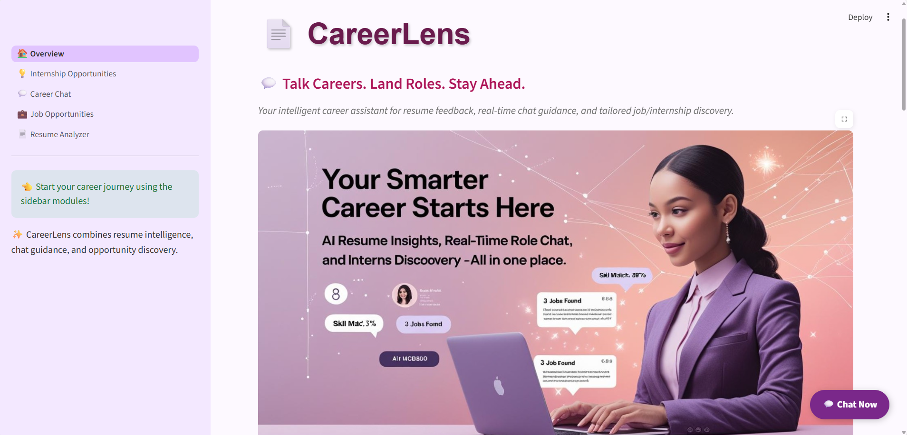
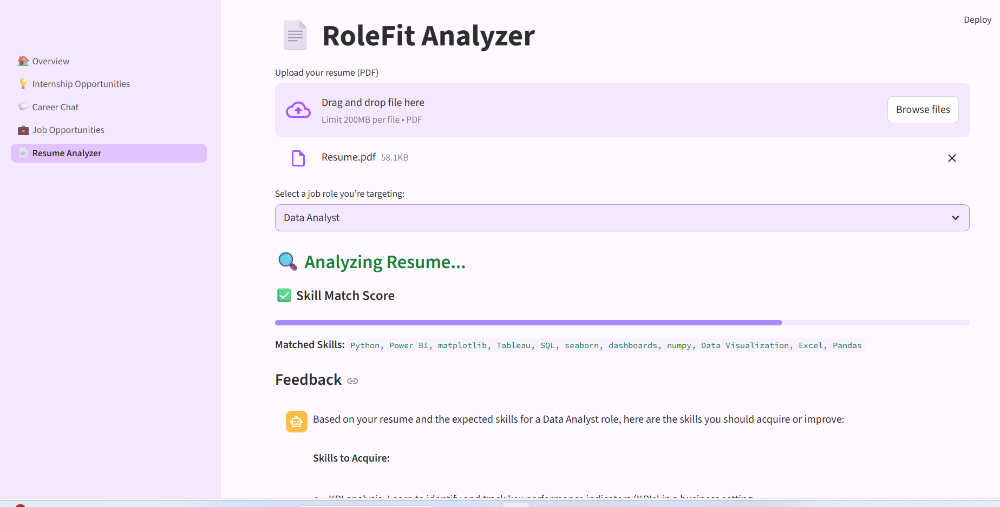
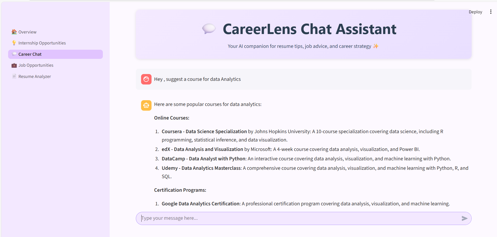
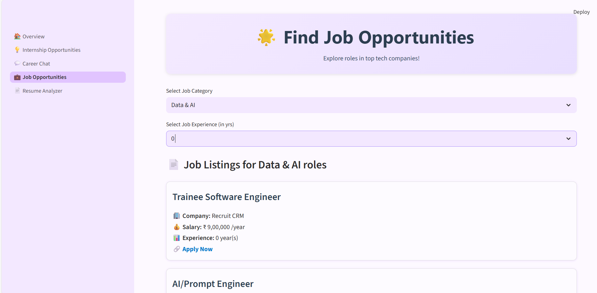

# 📄 CareerLens – Smarter Career Moves

 - CareerLens is your intelligent career assistant built with **Streamlit**, powered by **Meta’s LLaMA architecture** for advanced resume analysis and conversational career guidance. Whether you're a student, job seeker, or career explorer, CareerLens helps you refine your path with clarity and confidence.


---

## 🌟 Features

- ✅ Resume Analyzer powered by FLAN-T5 and LLaMA  
- ✅ Interactive Career Chat Assistant  
- ✅ Skill-Role Match Score & Insights  
- ✅ Curated Job & Internship Recommendations (scraped from Internshala)  
- ✅ Stylized PDF Generator for Feedback Reports  

---

## 🚀 How to Use CareerLens

1. Upload your resume (PDF format)
2. Start chatting with CareerLens about your goals
3. Discover role-matched job & internship openings
4. Analyze skill-role fit and strengths
5. Download shareable career feedback reports

---

## 🖼️ Screenshots

### 🏠 Homepage


### 📄 Resume Analyzer


### 💬 Career Chat Assistant


### 💼 Job & Internship Listings


---

## 📂 Project Structure
```
CareerLens/
│ ├── assets/                      # Banners and screenshots
├── pages/  
│   ├── 💡Internship Opportunities.py 
│   ├── 💬 Career Chat.py
│   ├── 💼 Job Opportunities.py │
└── 📄 Resume Analyzer.py 
├── 🏠 Overview.py                     # Landing page 
├── README.md                   # Project documentation 
└── requirements.txt            # Python dependencies
```
Absolutely, HANNI! Here's a polished and complete version of your README file for **CareerLens**, tailored to showcase its features, usage, and structure with clarity and professionalism:

---

## 🧠 Tech Stack

- **Streamlit** – UI framework for rapid prototyping  
- **FLAN-T5 & LLaMA** – NLP models for resume parsing and chat  
- **BeautifulSoup & Requests** – Web scraping for job listings  
- **PDFKit & Jinja2** – PDF generation for feedback reports  
- **Regex & Text Preprocessing** – Skill extraction and matching  

---

## 📦 Installation

```bash
# Clone the repository
git clone https://github.com/HanniKanchap/CareerLens.git
cd CareerLens

# Install dependencies
pip install -r requirements.txt

# Run the app
streamlit run "🏠 Overview.py"
```
## 🤝 Let’s Connect

Got feedback, feature ideas, or just want to chat about career tech and AI?  
I’d love to hear from you!

Feel free to reach out or connect with me on [LinkedIn](https://linkedin.com/hanni-kanchap).
Your suggestions can help CareerLens grow into an even more impactful career companion. 💬✨

